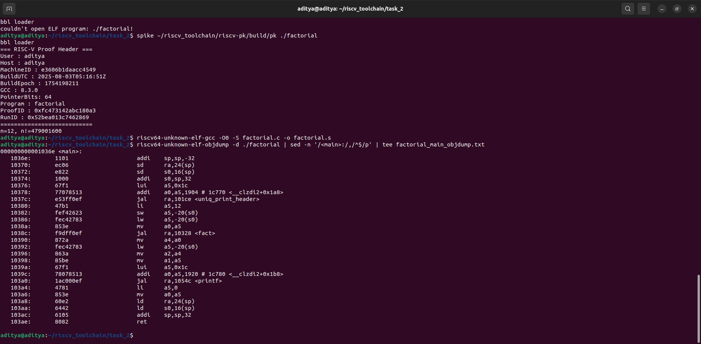
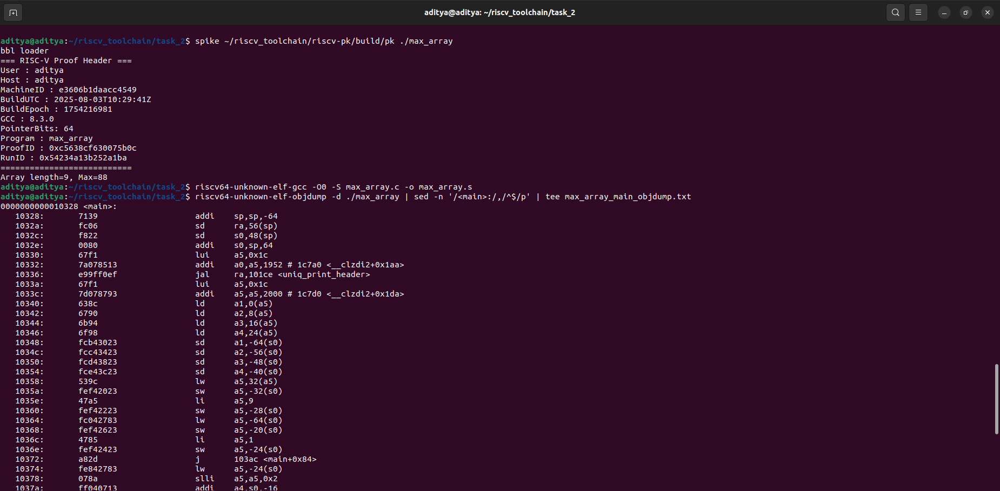
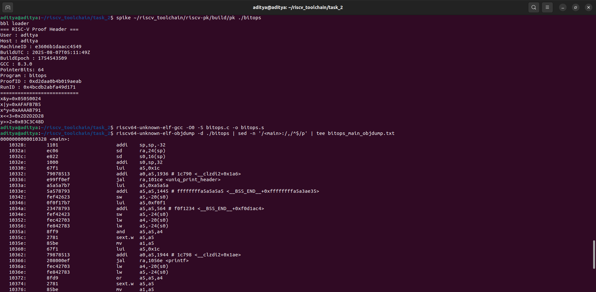
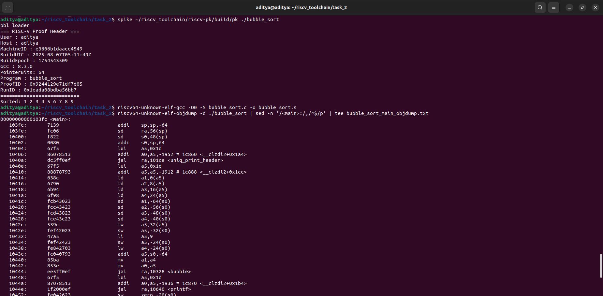

# TABLE OF CONTENTS

- [TASK-2.1 - Setting environment variables](#task-21---setting-environment-variables)
- [TASK-2.2 - Saving unique.h](#task-22---saving-uniqueh)
- [TASK-2.3 - Saving C files](#task-23---saving-c-files)
  - [TASK-2.3.1 - saving factorial.c](#task-231---saving-factorialc)
  - [TASK-2.3.2 - saving max_array.c](#task-232---saving-max_arrayc)
  - [TASK-2.3.3 - saving bitops.c](#task-233---saving-bitopsc)
  - [TASK-2.3.4 - saving bubble_sort.c](#task-234---saving-bubble_sortc)
- [TASK-2.4 - Compilation](#task-24---compilation)
  - [TASK-2.4.1 - Compile factorial.c](#task-241---compile-factorialc)
  - [TASK-2.4.2 - Compile max_array.c](#task-242---compile-max_arrayc)
  - [TASK-2.4.3 - Compile bitops.c](#task-243---compile-bitopsc)
  - [TASK-2.4.4 - Compile bubble_sort.c](#task-244---compile-bubble_sortc)
- [TASK-2.5 - Run on spike](#task-25---run-on-spike)
  - [TASK-2.5.1 - Run factorial.c](#task-251---run-factorialc)
  - [TASK-2.5.2 - Run max_array.c](#task-252---run-max_arrayc)
  - [TASK-2.5.3 - Run bitops.c](#task-253---run-bitopsc)
  - [TASK-2.5.4 - Run buubble_sort.c](#task-254---run-buubble_sortc)
- [TASK-2.6 - Assemble .s files](#task-26---assemble-s-files)
  - [TASK-2.6.1 - Assemble factorial.s](#task-261---assemble-factorials)
  - [TASK-2.6.2 - Assemble max_array.s](#task-262---assemble-max_arrays)
  - [TASK-2.6.3 - Assemble bitops.s](#task-263---assemble-bitopss)
  - [TASK-2.6.4 - Assemble bubble_sort.s](#task-264---assemble-bubble_sorts)
- [TASK-2.7 - Disassembly](#task-27---disassembly)
  - [TASK-2.7.1 - Disassembly of factorial](#task-271---disassembly-of-factorial)
  - [TASK-2.7.2 - Disassembly of max_array](#task-272---disassembly-of-max_array)
  - [TASK-2.7.3 - Disassembly of bitops](#task-273---disassembly-of-bitops)
  - [TASK-2.7.4 - Disassembly of bubble_sort](#task-274---disassembly-of-bubble_sort)
- [TASK-2.8 - Results](#task-28---results)
  - [TASK-2.8.1 - factorial](#task-281---factorial)
  - [TASK-2.8.2 - max_array](#task-282---max_array)
  - [TASK-2.8.3 - bitops](#task-283---bitops)
  - [TASK-2.8.4 - bubble_sort](#task-284---bubble_sort)
- [TASK-2.9 - Instruction Decoding](#task-29---instruction-decoding)
  - [TASK-2.9.1 - factorial](#task-291---factorial)
  - [TASK-2.9.2 - max_array](#task-292---max_array)
  - [TASK-2.9.3 - bitops](#task-293---bitops)
  - [TASK-2.9.4 - bubble_sort](#task-294---bubble_sort)
- [TASK-2.10 - Verifying spike and gcc versions](#task-210---verifying-spike-and-gcc-versions)
- [TASK-2.9 - Verifying spike and gcc versions](#task-29---verifying-spike-and-gcc-versions)


# TASK-2.1 - Setting environment variables

```bash
export U=$(id -un)
export H=$(hostname -s)
export M=$(cat /etc/machine-id | head -c 16)
export T=$(date -u +%Y-%m-%dT%H:%M:%SZ)
export E=$(date +%s)
```


# TASK-2.2 - Saving unique.h

```bash
#ifndef UNIQUE_H
#define UNIQUE_H

#include <stdio.h>
#include <stdint.h>
#include <time.h>

#ifndef USERNAME
#define USERNAME "unknown_user"
#endif

#ifndef HOSTNAME
#define HOSTNAME "unknown_host"
#endif

#ifndef MACHINE_ID
#define MACHINE_ID "unknown_machine"
#endif

#ifndef BUILD_UTC
#define BUILD_UTC "unknown_time"
#endif

#ifndef BUILD_EPOCH
#define BUILD_EPOCH 0
#endif

static uint64_t fnv1a64(const char *s) {
    const uint64_t OFF = 1469598103934665603ULL;
    const uint64_t PRIME = 1099511628211ULL;
    uint64_t h = OFF;
    for (const unsigned char *p = (const unsigned char *)s; *p; ++p) {
        h ^= *p;
        h *= PRIME;
    }
    return h;
}

static void uniq_print_header(const char *program_name) {
    time_t now = time(NULL);
    char buf[512];
    int n = snprintf(
        buf, sizeof(buf), "%s|%s|%s|%s|%ld|%s|%s",
        USERNAME, HOSTNAME, MACHINE_ID, BUILD_UTC,
        (long)BUILD_EPOCH, __VERSION__, program_name
    );
    (void)n;

    uint64_t proof = fnv1a64(buf);

    char rbuf[600];
    snprintf(rbuf, sizeof(rbuf), "%s|run_epoch=%ld", buf, (long)now);
    uint64_t runid = fnv1a64(rbuf);

    printf("=== RISC-V Proof Header ===\n");
    printf("User        : %s\n", USERNAME);
    printf("Host        : %s\n", HOSTNAME);
    printf("MachineID   : %s\n", MACHINE_ID);
    printf("BuildUTC    : %s\n", BUILD_UTC);
    printf("BuildEpoch  : %ld\n", (long)BUILD_EPOCH);
    printf("GCC         : %s\n", __VERSION__);
    printf("PointerBits : %d\n", (int)(8 * (int)sizeof(void *)));
    printf("Program     : %s\n", program_name);
    printf("ProofID     : 0x%016llx\n", (unsigned long long)proof);
    printf("RunID       : 0x%016llx\n", (unsigned long long)runid);
    printf("===========================\n");
}

#endif // UNIQUE_H
```


# TASK-2.3


## TASK-2.3.1 - saving factorial.c

```bash
#include "unique.h"
static unsigned long long fact(unsigned n){ return (n<2)?1ULL:n*fact(n-1); }
int main(void){
	uniq_print_header("factorial");
	unsigned n = 12;
	printf("n=%u, n!=%llu\n", n, fact(n));
	return 0;
}
```


## TASK-2.3.2 - saving max_array.c

```bash
#include "unique.h"
int main(void){
	uniq_print_header("max_array");
	int a[] = {42,-7,19,88,3,88,5,-100,37};
	int n = sizeof(a)/sizeof(a[0]), max=a[0];
	for(int i=1;i<n;i++) if(a[i]>max) max=a[i];
	printf("Array length=%d, Max=%d\n", n, max);
	return 0;
}
```


## TASK-2.3.3 - saving bitops.c

```bash
#include "unique.h"
int main(void){
	uniq_print_header("bitops");
	unsigned x=0xA5A5A5A5u, y=0x0F0F1234u;
	printf("x&y=0x%08X\n", x&y);
	printf("x|y=0x%08X\n", x|y);
	printf("x^y=0x%08X\n", x^y);
	printf("x<<3=0x%08X\n", x<<3);
	printf("y>>2=0x%08X\n", y>>2);
	return 0;
}
```


## TASK-2.3.4 - saving bubble_sort.c

```bash
#include "unique.h"
void bubble(int *a,int n){ for(int i=0;i<n-1;i++) for(int j=0;j<n-1-i;j++) if(a[j]>a[j+1]){int t=a[j];a[j]=a[j+1];a[j+1]=t;} }
int main(void){
	uniq_print_header("bubble_sort");
	int a[]={9,4,1,7,3,8,2,6,5}, n=sizeof(a)/sizeof(a[0]);
	bubble(a,n);
	printf("Sorted:"); for(int i=0;i<n;i++) printf(" %d",a[i]); puts("");
	return 0;
}
```


# TASK-2.4


## TASK-2.4.1 - Compile factorial.c

```bash
riscv64-unknown-elf-gcc -O0 -g -march=rv64imac -mabi=lp64 \
-DUSERNAME="\"$U\"" -DHOSTNAME="\"$H\"" -DMACHINE_ID="\"$M\"" \
-DBUILD_UTC="\"$T\"" -DBUILD_EPOCH=$E \
factorial.c -o factorial
```


## TASK-2.4.2 - Compile max_array.c

```bash
riscv64-unknown-elf-gcc -O0 -g -march=rv64imac -mabi=lp64 \
-DUSERNAME="\"$U\"" -DHOSTNAME="\"$H\"" -DMACHINE_ID="\"$M\"" \
-DBUILD_UTC="\"$T\"" -DBUILD_EPOCH=$E \
max_array.c -o max_array
```


## TASK-2.4.3 - Compile bitops.c

```bash
riscv64-unknown-elf-gcc -O0 -g -march=rv64imac -mabi=lp64 \
-DUSERNAME="\"$U\"" -DHOSTNAME="\"$H\"" -DMACHINE_ID="\"$M\"" \
-DBUILD_UTC="\"$T\"" -DBUILD_EPOCH=$E \
bitops.c -o bitops
```


## TASK-2.4.4 - Compile bubble_sort.c

```bash
riscv64-unknown-elf-gcc -O0 -g -march=rv64imac -mabi=lp64 \
-DUSERNAME="\"$U\"" -DHOSTNAME="\"$H\"" -DMACHINE_ID="\"$M\"" \
-DBUILD_UTC="\"$T\"" -DBUILD_EPOCH=$E \
bubble_sort.c -o bubble_sort
```


# TASK-2.5


## TASK-2.5.1 - Run factorial.c

```bash
spike ~/riscv_toolchain/riscv-pk/build/pk ./factorial
```


## TASK-2.5.2 - Run max_array.c

```bash
spike ~/riscv_toolchain/riscv-pk/build/pk ./max_array
```


## TASK-2.5.3 - Run bitops.c

```bash
spike ~/riscv_toolchain/riscv-pk/build/pk ./bitops
```


## TASK-2.5.4 - Run buubble_sort.c

```bash
spike ~/riscv_toolchain/riscv-pk/build/pk ./bubble_sort
```


# TASK-2.6


## TASK-2.6.1 - Assemble factorial.s

```bash
riscv64-unknown-elf-gcc -O0 -S factorial.c -o factorial.s
```


## TASK-2.6.2 - Assemble max_array.s

```bash
riscv64-unknown-elf-gcc -O0 -S max_array.c -o max_array.s
```


## TASK-2.6.3 - Assemble bitops.s

```bash
riscv64-unknown-elf-gcc -O0 -S bitops.c -o bitops.s
```


## TASK-2.6.4 - Assemble bubble_sort.s

```bash
riscv64-unknown-elf-gcc -O0 -S bubble_sort.c -o bubble_sort.s
```


# TASK-2.7


## TASK-2.7.1 - Disassembly of factorial
```bash
riscv64-unknown-elf-objdump -d ./factorial | sed -n '/<main>:/,/^$/p' | tee factorial_main_objdump.txt
```


## TASK-2.7.2 - Disassembly of max_array
```bash
riscv64-unknown-elf-objdump -d ./max_array | sed -n '/<main>:/,/^$/p' | tee max_array_main_objdump.txt
```


## TASK-2.7.3 - Disassembly of bitops
```bash
riscv64-unknown-elf-objdump -d ./bitops | sed -n '/<main>:/,/^$/p' | tee bitops_main_objdump.txt
```


## TASK-2.7.4 - Disassembly of bubble_sort
```bash
riscv64-unknown-elf-objdump -d ./bubble_sort | sed -n '/<main>:/,/^$/p' | tee bubble_sort_main_objdump.txt
```


# TASK-2.8 - Results


## TASK-2.8.1 - factorial




## TASK-2.8.2 - max_array




## TASK-2.8.3 - bitops




## TASK-2.8.4 - bubble_sort




# TASK-2.9 - Verifying spike and gcc versions


